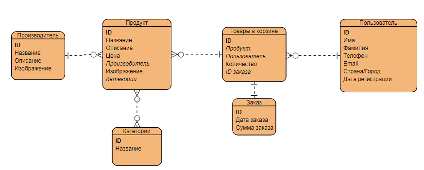

# Очень полезная информация
## Тесты
* Запускать тесты перед пушем в ветку!!!
* Именование тестов: `НазваниеФункции_Параметры_ОжидаемыйРезультат`
* Именование классов с тестами: `ИмеТестируемогоКлассаTests`

## ERD
* Сайт - https://online.visual-paradigm.com
* Картинка
